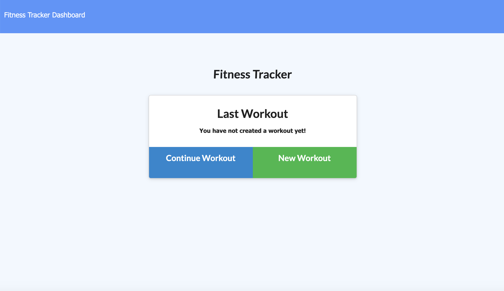
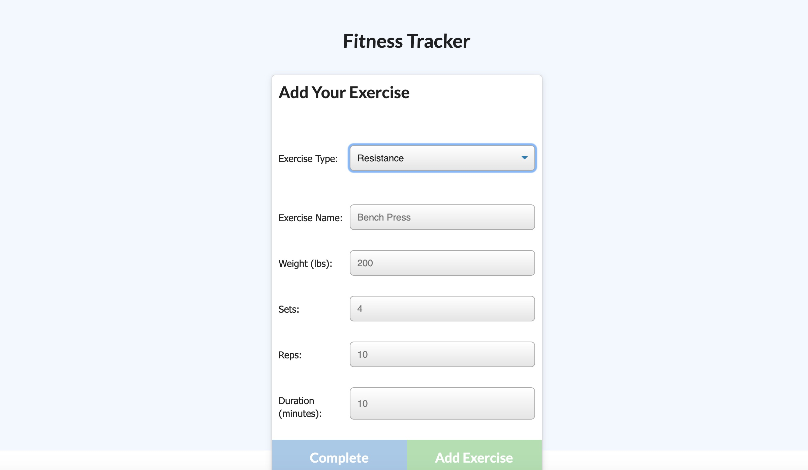

# Welcome to workout-Tracker!
  
  

  ## Description
   This application was designed for users to be able to track their weekly or even daily workouts. Allowing you to in out cardio or resistance. Then you will be able to add the name of your workout along with the distance and ration of your workout.

   

   
   

   
    
  ## Hosted Application
  
   The application is hosted on Heroku and can be found here https://workout-tracker-al.herokuapp.com/
    
  ## Table of Contents
  Navigate through the README Using the Table of Contents : 

  * [Installation](#installation)
  * [Usage](#usage)
  * [License](#license)
  * [Contributions](#contributing)
  * [Badges](#badges)
  * [Tests](#tests)
  * [Questions](#questions)

  ## Installation
    Navigate and log your workouts using  workout-Tracker. It helps track your workouts on and off line using mongodb database. The website is run through heroku.

  ## Usage
    This project uses Javascript, HTML, CSS, and React and the following npm packages : express, express-handlebars, eslint, mysql, sequelize, react.

  ## License
  MIT

  ## Badges
  
  
  

  ## Tests

  
  ## Questions
  Please forward all questions about the project to [allielewis07@gmail.com](allielewis@gmail.com)
  
